## 0. Download data &  Pretrain model

```
python3 data_download.py # download original train & test data
```

download gmm & tom pretrain model from: 
https://drive.google.com/open?id=18ncLRuKLFtGKabaco9Bur1wCTVQjvAI1

create directory `checkpoints/gmm_train_new/` & `checkpoints/tom_train_new/` <br>
place `gmm_final.pth` into `checkpoints/gmm_train_new/` <br>
place `tom_final.pth` into `checkpoints/tom_train_new/`

## 1. Train

```
sh step1-train-gmm.sh # no need this step since we use pretrain model
sh step2-test-gmm.sh
sh step3-generate-tom-data.sh
mv result/gmm_final.pth/train/* data/train/
mv result/gmm_final.pth/test/warp-mask data/test/
mv result/gmm_final.pth/test/warp-cloth data/test/
sh step4-train-tom.sh # no need this step since we use pretrain model
sh step5-test-tom.sh
```

**TensorBoard**

```
tensorboard/
├── gmm_traintest_new
│   └── events.out.tfevents.1568185067.tplustf-imagealgo-50529-ever-chief-0
├── tom_test_new
│   └── events.out.tfevents.1568473618.tplustf-imagealgo-50529-ever-chief-0
    
$ tensorboard --logdir tensorboard/gmm_traintest_new/
$ tensorboard --logdir tensorboard/tom_test_new/
```

web: 

	http://everdemacbook-pro.local:6006/#scalars
	http://everdemacbook-pro.local:6006/#images

scalars / images :

	gmm_traintest_new

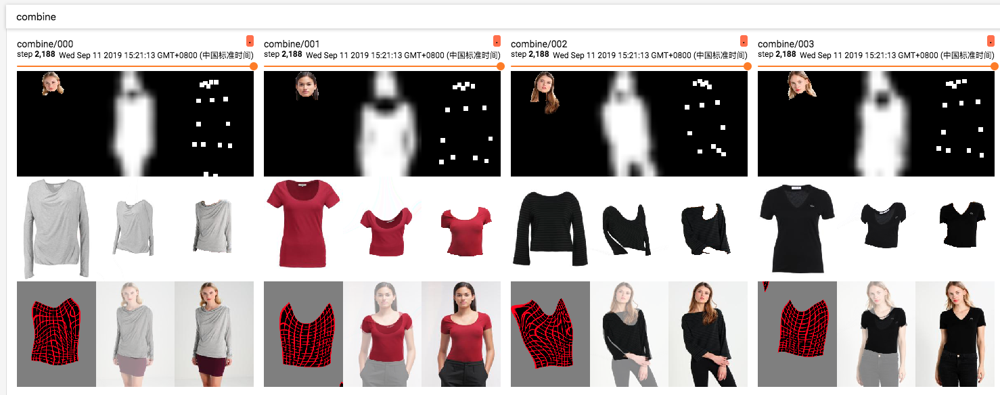

	tom_test_new

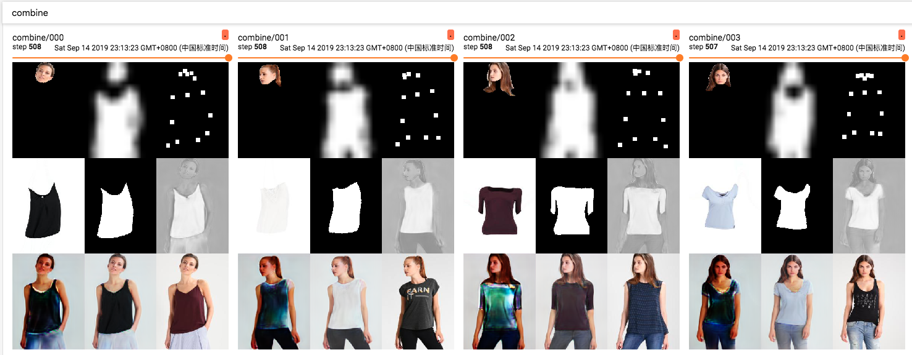


## 2. Visualize

执行前**STEPs**中所列步骤，后执行```python smart_show_test_result.py```， 可以在```result_simple```文件夹下查看生成结果，示例图片如下，从左到右每列图片意思是：

[cloth, cloth-mask, model-image, model-image-parse, cloth-warp, cloth-warp-mask, try-on-result]

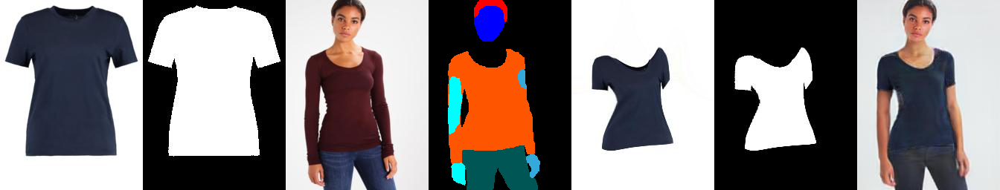
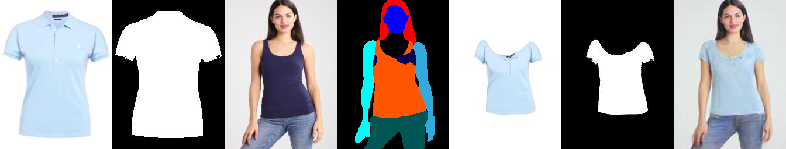
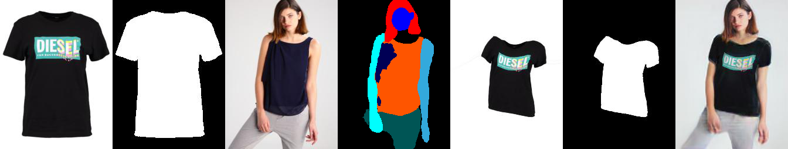
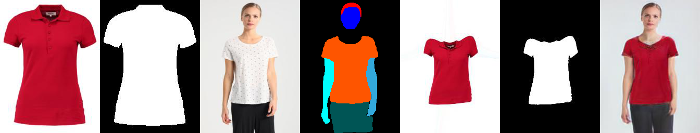
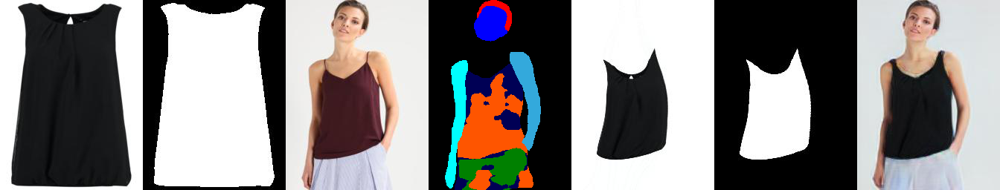
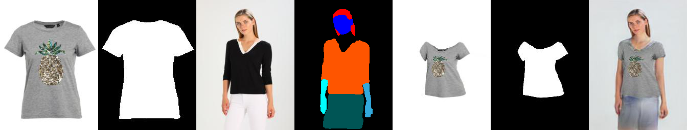
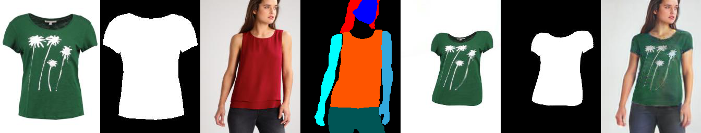
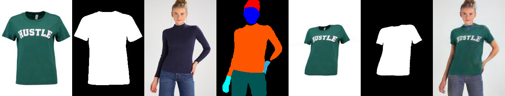
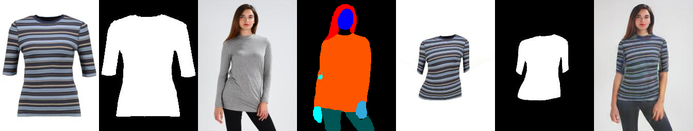


## 4. Virtual Try-On 技术路线的瓶颈

虚拟模特图像生成，技术上大致有三条路实现。

“Virtual Try-On”（VTON）是其中一种方式。


**VTON技术有如下考虑：**

1. 规避模特生成问题，模特生成本身比较难以做到，难以做到对模特面孔头发、身材真实性等方面的保真度，VTON技术路线规避该问题；
2. 默认模特已经穿着了和待合成服饰尺寸形状大体一致的服饰，通过对服饰做Warping进而“贴图”，实现Try-On的效果。


**技术产品化VTON思路还有些问题：**

 1. 对指定模特，给他换上另外一套衣服，需要妥善处理版权问题；
 2. 服装和人的搭配问题，如何保持视觉协调；
 3. 服装穿着在人身上产生的自然形变，因为对服饰做Warping没有根本解决对服饰的理解问题；（如下图条纹状服饰）
 4. 模特摆拍姿势多样，肢体和服装之间的遮挡问题;（如下图手臂遮挡服饰）
 5. 当前数据和实验，数据限于上衣短袖类目，图像尺寸256x192, 还属于Toy级别实验；

**条纹状服饰**

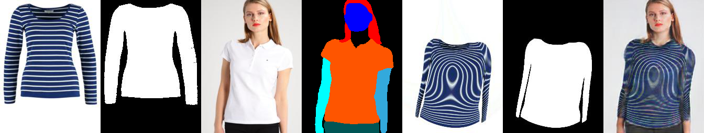
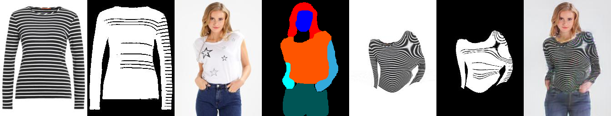
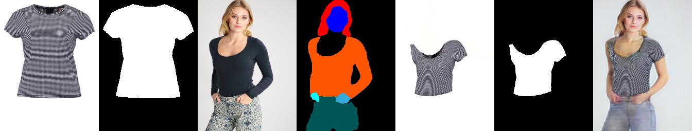

**手臂遮挡服饰**
 
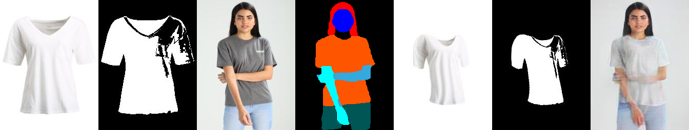
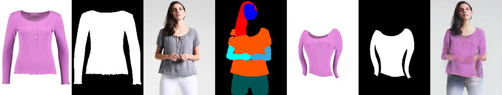
 
 
## 5. 算法演进方向

**Virtual Try-on**

致敬诸位的创意，这条路还有很多技术点要解决。


```
.
├── 2017-VITON-MalongTech
│   ├── 1705.09368.Pose Guided Person Image Generation.pdf
│   ├── 1711.08447.VITON- An Image-based Virtual Try-on Network.pdf
│   ├── 1902.01096.Compatible and Diverse Fashion Image Inpainting.pdf
│   └── 2002-TPAMI-Shape matching and object recognition using shape contexts.pdf
├── 2018-CP-VTON-SenseTime
│   └── 1807.07688.Toward Characteristic-Preserving Image-based Virtual Try-On Network.pdf
├── 2019-Multi-pose Guided Virtual Try-on Network (MG-VTON)
│   └── 1902.11026.Towards Multi-pose Guided Virtual Try-on Network.pdf
├── 2019-WUTON
│   └── 1906.01347.End-to-End Learning of Geometric Deformations of Feature Maps for Virtual Try-On.pdf 
```

